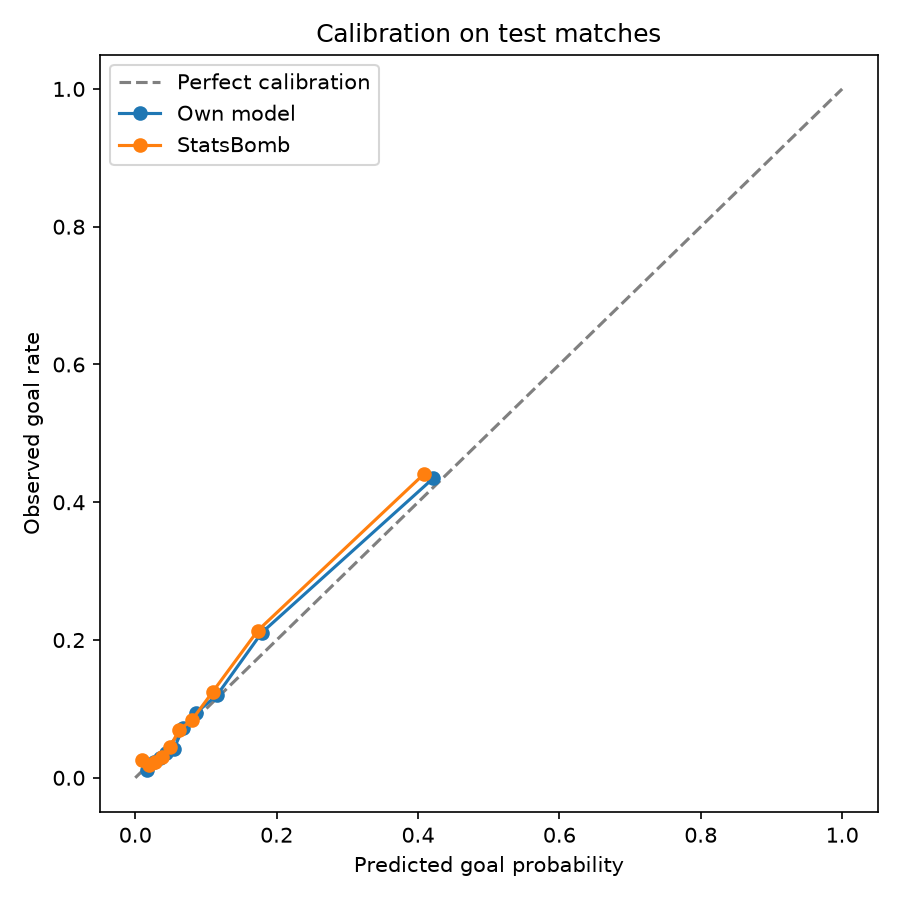

# xG model

Expected goals for football shots, built from scratch: a data pipeline, feature engineering, a logistic regression written in NumPy, and a small web app to play around with it.

[](https://github.com/Alexschaer/xg-model/actions/workflows/ci.yml)

Try it here: https://xg-model.onrender.com

It runs on Render's free tier, so if nobody has used it for a while, the first load takes about a minute while the server wakes up.


## What this is

Expected goals (xG) is the probability that a shot ends up in the net, judged only by what's known at the moment it's taken. A penalty is around 0.76, a header from the edge of the box is more like 0.03.

I wanted to find out how close I could get to a commercial xG model without using an ML library for the model itself, and what such a model says about a few football questions I was curious about. Everything in this repo, from downloading the raw event data to the web app, is my own code.

## Result

Trained on 79,032 shots and evaluated on 19,515 shots from matches the model never saw during training:

| | Test log loss |
|---|---|
| Always predicting the average goal rate (10.2 %) | 0.3411 |
| This model | 0.2719 |
| StatsBomb's own xG | 0.2714 |

That closes about 99 % of the gap between a naive guess and StatsBomb's model. The comparison isn't perfectly fair in either direction: my model was trained on exactly this kind of data, while StatsBomb's model probably uses information that isn't part of the open data.

Calibration on the test matches, with shots grouped into ten buckets of equal size:



Overall it's well calibrated. The one consistent miss is in the upper middle: shots the model rates at 18 % go in about 21 % of the time.

## What the model says about football

The predictions themselves aren't the most interesting part. What's interesting is comparing the raw numbers with what the model says once everything else about a shot is held constant. A lot of things that look important in the raw data turn out to matter mostly because of where they put the shooter.

Shots after a through ball go in three times as often as other shots (30 % vs 10 %). With position, defenders and goalkeeper accounted for, a through ball still lifts a 10 % chance to about 17.5 %. So part of its value is the better position it creates, but not all of it.

Cut-backs look good in the raw data too (15.6 % vs 10.3 %), but once the model knows where the shooter is standing, they add almost nothing. Same with one-on-ones: 25.5 % in the raw data, but the label barely adds anything to what the freeze frame already shows, namely no defender in the way and a lot of space.

The first defender between ball and goal matters most. It takes a 10 % chance down to about 7 %, and every additional defender matters much less. Headers roughly halve the chance compared to a shot with the foot from the same spot.

Teams that are ahead get much better chances than teams that are behind: 15.4 % when two goals up, 8.2 % when two goals down. In the model, though, the score itself barely matters (about +7 % in odds per goal of lead). Teams in front get better chances because they get better situations, like counter-attacks against an opponent that has pushed up. Team strength behaves the same way.

For women's and men's football there's no measurable difference for the same situation (odds ratio 0.998). The model can only express an overall difference, though, so it wouldn't notice if, say, headers behaved differently.

All numbers come from `uv run python -m xg_model.modelling.train`, which also prints the full table of feature effects.

## How it works

**Data.** StatsBomb open data: 3,961 matches from 80 competition seasons and about 101,000 shots. The most useful parts are four complete men's leagues from 2015/16 and a lot of women's football. Every shot comes with a freeze frame, the positions of all visible players at the moment of the shot.

**Features.** 48 inputs per shot, among them:

- distance to goal and the angle under which the goal mouth is seen
- from the freeze frame: defenders inside the triangle between ball and posts, distance to the nearest opponent, goalkeeper position
- body part, technique, how the attack started, type of assist
- score at the time of the shot, home or away, minute
- team strength as a pre-match Elo rating, updated match by match so that no information from later games leaks in

Penalties, shoot-outs and historical single matches from before 2003/04 are left out.

**Model.** A logistic regression trained with batch gradient descent, written in NumPy (`src/xg_model/modelling/logistic_regression.py`). Features are standardised using statistics from the training set only. The train/test split is done by match, so shots from the same game never end up on both sides.

## Things I learned along the way

The first version trained for 1,000 iterations and the loss was still falling. Part of what looked like poor calibration was simply an unfinished model. Going to 3,000 iterations fixed most of it.

A linear model can't express "the first defender matters a lot, the fifth one barely". Adding log(distance) and a flag for "any defender in the way" helped with that.

I stopped tuning after three experiments. Every change I keep because it looks better on the test set fits the model a little more to that test set. For more tuning I'd need a separate validation split.

The model looked great on the test set and still produced nonsense in the app. With no defenders placed, a shot from 30 yards got 49 %. The feature "space to the nearest opponent" was being extrapolated far beyond anything in the training data, where the nearest opponent is almost always within a few yards. A behavioural test (closer shots must be better) caught it, and capping the feature at 8 yards, the 99th percentile, fixed it.

## Project structure

```
src/xg_model/
  data/        download StatsBomb files, keep shots, key passes and own goals
  features/    geometry, freeze frame, game state, Elo ratings, the shot table
  modelling/   preparation, train/test split, logistic regression, metrics, plots
  serving/     turns a described shot situation into model inputs
  api/         FastAPI app and the frontend (plain JavaScript and SVG)
tests/         same structure as src/
models/        the trained model as JSON
```

Each layer only depends on the ones listed above it. The app goes through the same feature code as the training data, so a situation set up in the browser is processed exactly like a real shot from the dataset.

## Tooling

uv for dependencies, ruff for linting and formatting, pytest with a coverage threshold of 90 % (currently around 97 %). GitHub Actions runs all of it on every push, and Render only deploys a commit once those checks have passed. The app runs in a Docker container, and there's a dev container config, so the repo opens ready to use in GitHub Codespaces.

## Running it locally

```bash
uv sync
uv run python -m xg_model.data.ingest         # downloads ~4,000 matches, takes a while
uv run python -m xg_model.features.table      # builds data/shots.parquet
uv run python -m xg_model.modelling.train     # trains, evaluates, writes models/xg_model.json
uv run uvicorn xg_model.api.app:app --reload  # app on http://localhost:8000
```

The trained model is part of the repo, so the last command also works on its own.

## Limitations

- The open data isn't a random sample of football. It's complete 2015/16 seasons, big tournaments, a lot of women's football, and Barcelona's league matches from the Messi years.
- Elo ratings only exist for complete leagues. For tournaments and the Barcelona matches, that feature is empty.
- The app's inputs are simplified: pass length is fixed, and team strength is always treated as unknown.
- The test set was used to compare three versions of the model, so the final numbers are slightly optimistic.

## Data

Event data from [StatsBomb Open Data](https://github.com/statsbomb/open-data). Thanks to StatsBomb for making it public.
